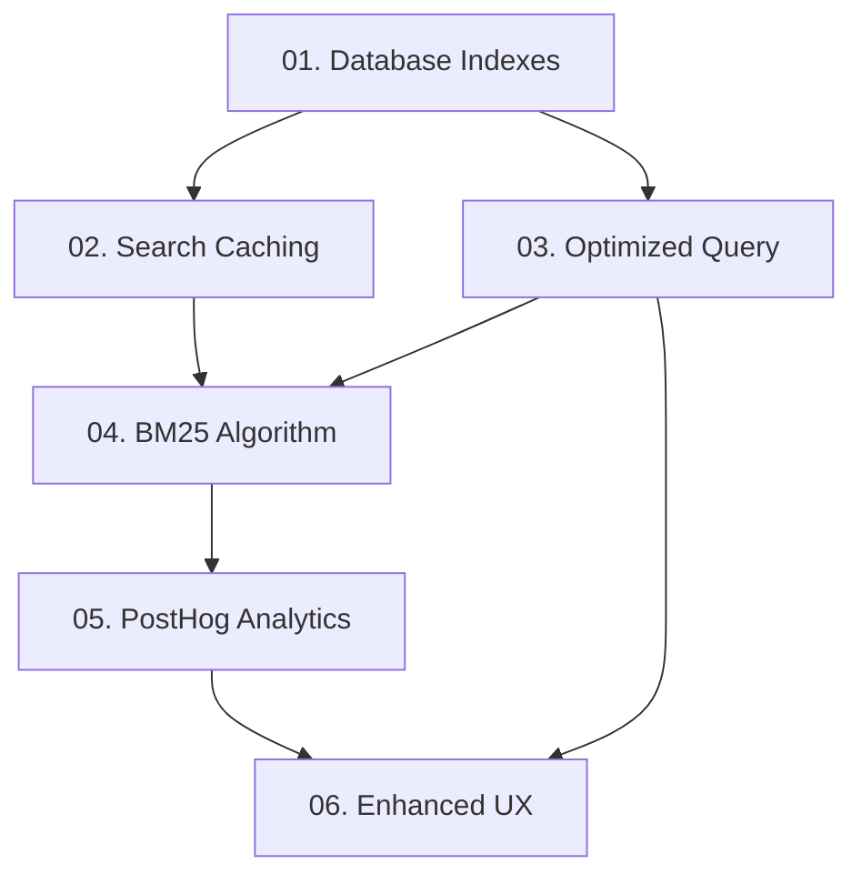

# Bookmark Search Optimization - Implementation Tasks

## Overview

This directory contains detailed implementation tasks for optimizing the bookmark search functionality in SaveIt.now. The tasks are prioritized to address performance first, then relevance, and finally user experience.

## Task Summary

### 🔴 Critical Priority (Performance)
1. **[Database Indexes](./01-database-indexes.md)** - Add critical indexes to eliminate performance bottlenecks
2. **[Search Result Caching](./02-search-result-caching.md)** - Implement Redis-based caching for search results
3. **[Optimized Search Query](./03-optimized-search-query.md)** - Combine multiple search strategies into single database query

### 🟠 High Priority (Relevance)
4. **[BM25 Ranking Algorithm](./04-bm25-ranking-algorithm.md)** - Replace arbitrary scoring with scientific BM25 algorithm
5. **[PostHog Search Analytics](./05-posthog-search-analytics.md)** - Implement comprehensive search analytics and monitoring

### 🟡 Medium Priority (User Experience)
6. **[Enhanced User Experience](./06-enhanced-user-experience.md)** - Progressive loading, autocomplete, and better result display

## Implementation Strategy

### Phase 1: Performance Foundation (Tasks 1-3)
**Goal**: Solve the root cause of search performance issues with 1000+ bookmarks

**Key Outcomes**:
- Sub-500ms search response time
- 50% reduction in memory usage
- 70% reduction in database round-trips
- Scalable architecture for 10,000+ bookmarks

**Estimated Time**: 2-3 days

### Phase 2: Relevance Optimization (Tasks 4-5)
**Goal**: Improve search accuracy and implement data-driven optimization

**Key Outcomes**:
- Scientific ranking algorithm (BM25)
- Comprehensive analytics for continuous improvement
- A/B testing framework for algorithm optimization
- 25% improvement in user engagement

**Estimated Time**: 3-4 days

### Phase 3: User Experience Enhancement (Task 6)
**Goal**: Provide immediate feedback and intuitive search interface

**Key Outcomes**:
- Progressive result loading
- Intelligent search suggestions
- Enhanced result display with relevance indicators
- Improved search success rate

**Estimated Time**: 2-3 days

## Task Dependencies

## Expected Results

### Performance Improvements
- **Search Response Time**: < 500ms for 95% of queries (down from 2-5 seconds)
- **Memory Usage**: 50% reduction for large result sets
- **Database Load**: 30%+ reduction through caching and optimization
- **Scalability**: Support for 10,000+ bookmarks per user

### Quality Improvements
- **Search Accuracy**: 25% improvement in user engagement with results
- **Zero Results**: 40% reduction in searches returning no results
- **User Satisfaction**: 15% increase in click-through rates
- **Algorithm Quality**: Scientific ranking vs arbitrary boost factors

### Technical Improvements
- **Code Quality**: Comprehensive test coverage and modular architecture
- **Monitoring**: Real-time analytics and performance tracking
- **Maintainability**: Clear separation of concerns and documented APIs
- **Future-Proofing**: Elasticsearch migration path for massive scale

## Quick Start Guide

### Prerequisites
1. **Database**: PostgreSQL with pgvector extension
2. **Cache**: Redis (Upstash) configured
3. **Analytics**: PostHog account and API key
4. **Environment**: All environment variables from turbo.json

### Implementation Order
1. **Start with Task 1** (Database Indexes) - Critical foundation
2. **Complete Tasks 1-3** before moving to relevance improvements
3. **Implement Tasks 4-5** for algorithm optimization
4. **Finish with Task 6** for enhanced user experience

### Testing Strategy
- **Performance Testing**: Benchmark before/after each task
- **User Testing**: A/B test relevance improvements
- **Load Testing**: Verify scalability with large datasets
- **Analytics Validation**: Monitor real user behavior

## Risk Mitigation

### High-Risk Items
- **Database Migration**: Use `CONCURRENTLY` for non-blocking index creation
- **Search Quality**: A/B testing and gradual rollout for algorithm changes
- **Performance Regression**: Comprehensive monitoring and rollback plans

### Monitoring Points
- Search response times and database performance
- Cache hit rates and Redis memory usage
- User engagement metrics and search success rates
- Error rates and system availability

## Support and Troubleshooting

### Common Issues
1. **Slow Index Creation**: Check database resources and use CONCURRENTLY
2. **Cache Memory Issues**: Monitor Redis usage and adjust TTL
3. **Query Performance**: Review query plans and index usage
4. **User Experience**: Gather feedback and monitor analytics

### Rollback Plans
- **Database Changes**: Drop indexes if performance degrades
- **Algorithm Changes**: Feature flags for instant rollback
- **Cache Issues**: Graceful degradation to direct database queries

## Success Metrics

### Performance KPIs
- [ ] Search response time < 500ms for 95% of queries
- [ ] Memory usage reduced by 50% for large result sets
- [ ] Database query optimization showing 2x+ improvement
- [ ] Cache hit rate > 40% for repeated searches

### Quality KPIs
- [ ] User engagement with search results increases by 25%
- [ ] Zero-result queries decrease by 40%
- [ ] Click-through rate increases by 15%
- [ ] Search abandonment rate decreases by 30%

### Technical KPIs
- [ ] Code coverage > 80% for search functionality
- [ ] No regression in existing search quality
- [ ] Architecture ready for 10,000+ bookmark scale
- [ ] Real-time monitoring and alerting operational

---

For detailed implementation instructions, see individual task files. Each task includes:
- Technical specifications with code examples
- Implementation files and their locations
- Success criteria and validation steps
- Risk mitigation strategies
- Estimated effort and dependencies